/# vulnerability-analysis-project

# Part 1 – Understanding Vulnerability Analysis and Setting Up Nessus

## Objective

I want to understand what Vulnerability Analysis is about. I need to learn how it is different from scanning networks and finding out what is on them. I also want to set up Nessus Essentials so I can use it to find vulnerabilities.

---

# What is Vulnerability Analysis?

Vulnerability Analysis is a process. It helps us find security weaknesses in operating systems, applications and network services. We do this before someone with intentions can find and use these weaknesses against us.

Vulnerability Analysis is not the same as scanning a network. When we scan a network we are just trying to find out what computers and services are available.. With Vulnerability Analysis we are trying to figure out if those computers and services have any known security problems. We also want to know how bad these problems could be.

The main things we want to do with Vulnerability Analysis are:

- Find vulnerabilities

- Figure out how risk they pose

- Decide which ones to fix first

- Make our organizations security better

---

# Difference Between Scanning Finding Out More and Vulnerability Analysis

| Phase | Purpose  |


| Network Scanning | Find computers, open ports and services on the network |

| Finding Out More | Get details about the services we found |

| Vulnerability Analysis | Find known security weaknesses in those services |

---

# How to Do a Vulnerability Assessment

To do a vulnerability assessment we need to follow some steps:

1. Decide what we want to assess.

2. Set up our vulnerability scanner.

3. Scan the computers and services we're interested in.

4. Look at the vulnerabilities we found.

5. Figure out which ones are the important to fix.

6. Recommend how to fix them.

---

# Our Lab Environment

## The Computer We Will Use to Attack

- We will use Kali Linux.

## The Computers We Will Attack

- 2

- Windows 7

## The Tool We Will Use to Find Vulnerabilities

- Nessus Essentials

---

## Step 1: Check if the Nessus Service is Running

### What We Are Doing

We need to make sure the Nessus service is installed and running before we start.

### What to Type

```bash

sudo systemctl status nessusd

```

### What This Does

This command tells us if the Nessus service is running or not.

### Screenshot

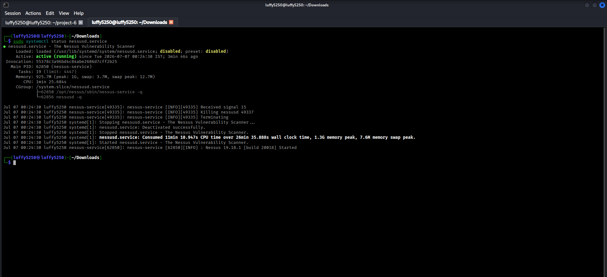

---

## Step 2: Start the Nessus Service

### What We Are Doing

If the Nessus service is not running we need to start it.

### What to Type

```bash

sudo systemctl start nessusd

```

### What This Does

This command starts the Nessus service.

### Screenshot

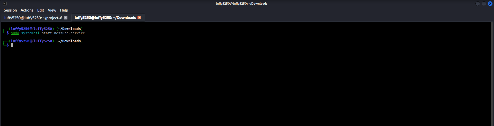

---

## Step 3: Open the Nessus Dashboard

### What We Are Doing

Now we need to open the Nessus web interface.

### Where to Go

```text

https://localhost:8834

```

### What This Does

We open the Nessus Essentials dashboard in our web browser and make sure the login page comes up correctly.

### Screenshot

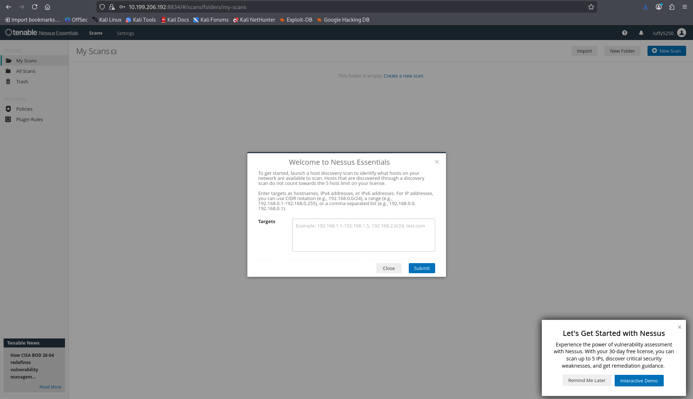
nessus-service-status
---

# Things I Learned

- What Vulnerability Analysis is

- How to do a Vulnerability Assessment

- What Nessus Essentials is

- How to use the Nessus web interface

- The steps to follow for a vulnerability assessment

---

# Key Concepts Learned

- Vulnerability Analysis
- Vulnerability Assessment
- Nessus Essentials
- Assessment Workflow
- Nessus Web Interface

--------------------------------------------------------------------------------------------------------------------------------------------------------------

# Part 2 – Creating a Vulnerability Scan in Nessus

## Objective

The goal is to create and set up a Basic Network Scan in Nessus Essentials. This will help us get ready to check the vulnerability of the lab machines we are allowed to use.

---

# Scan Configuration

We need to set up a vulnerability scan before Nessus can start finding security weaknesses.

At this point we need to decide on a things:

- What to name the scan

- What the target IP address is

- Where to save the scan

- What scan template to use

This information tells Nessus which system to check.

---

## 1. Create a New Scan

### Scenario

We want to create a vulnerability assessment.

### Steps

1. We click on **New Scan**

2. Then we select **Basic Network Scan**

### Description

The **Basic Network Scan** template is a choice for general vulnerability assessments. It can help us find security weaknesses.

### Screenshot

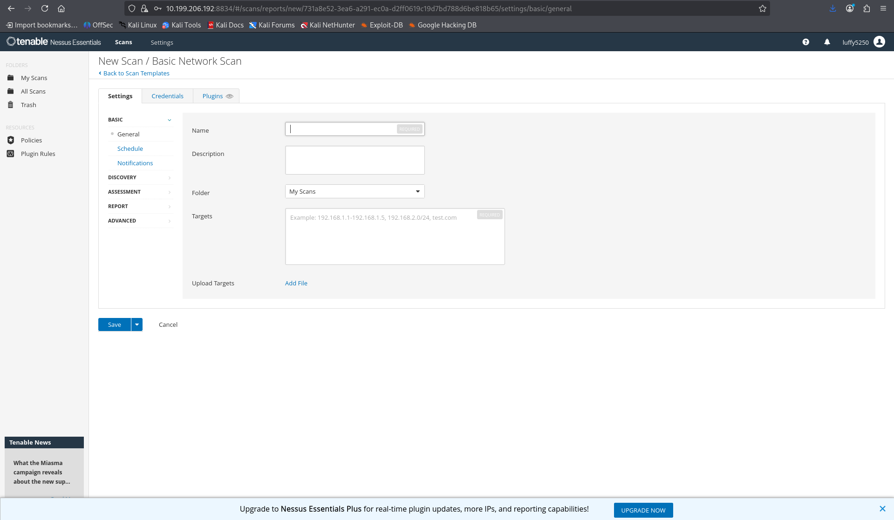

---

## 2. Configure the Target

### Scenario

Now we configure the scan for  Metasploitable 2.

### Configuration

| Field | Value |


| Name | Metasploitable 2 Scan |

| Targets | 10.199.206.53 |

| Folder | My Scans |

If we are using Windows 7 we need to replace the target IP with the address of our Windows machine.

### Screenshot

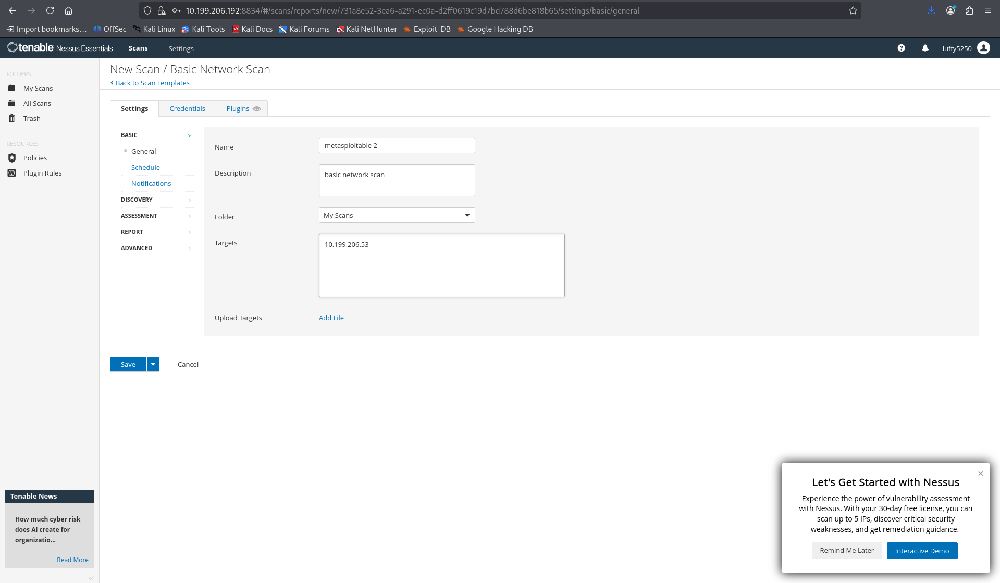

---

## 3. Review Scan Settings

### Scenario

We need to check the scan configuration before we save it.

### Verify

- The name of the scan

- The target IP

- The template

- The folder

### Description

Reviewing the configuration helps us avoid scanning the wrong target or using the wrong template.

### Screenshot


---

## 4. Save the Scan

### Scenario

Now we save the configured scan.

### Action

We click on:

```text

Save

```

### Description

Saving the configuration creates a scan profile that we can use later.

### Screenshot

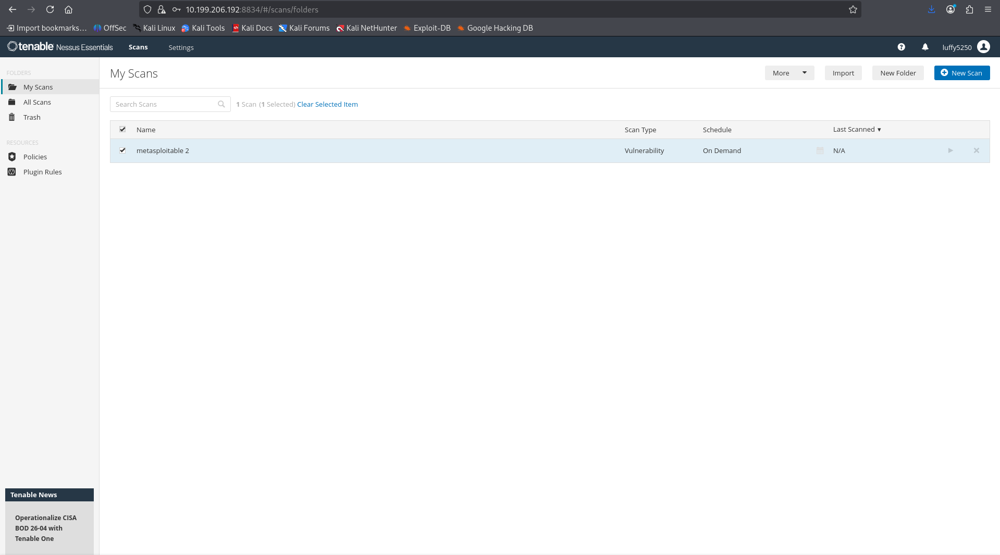

---

# Key Concepts Learned

- Basic Network Scan

- Scan Configuration

- Target Definition

- Scan Templates

- Scan Profiles

---

# Conclusion

In this part, I learned:

- How to create a Basic Network Scan.
- How to configure an authorized target.
- How to review scan settings before execution.
- How to save a reusable scan profile.


--------------------------------------------------------------------------------------------------------------------------------------------------------------------------------------------

# Part 3 – Running a Vulnerability Scan

## Objective

I will launch a vulnerability scan against the lab machines using Nessus Essentials. I will monitor the scan progress until it is finished.

---

# Why Run the Scan?

After I create a scan profile Nessus Essentials starts talking to the target system to find out about the target system. It looks for things like

- what services are open on the target system

- what software is installed on the target system

- if the target system has any known vulnerabilities

- if the target system has any weaknesses in its configuration

- what security risks the target system has

Nessus Essentials compares the information it collects from the target system with its database of vulnerabilities and it makes a detailed report.

---

# Lab Targets

- Metasploitable 2

- Windows 7

---

## 1. Launch the Scan

### Scenario

Now I will start the vulnerability assessment that I set up.

### Steps

1. I will open **My Scans**.

2. I will find the scan profile that I saved.

3. I will click the **Launch play** button.

### Description

Nessus Essentials starts checking the target system using the template and plugins that I chose.

### Screenshot

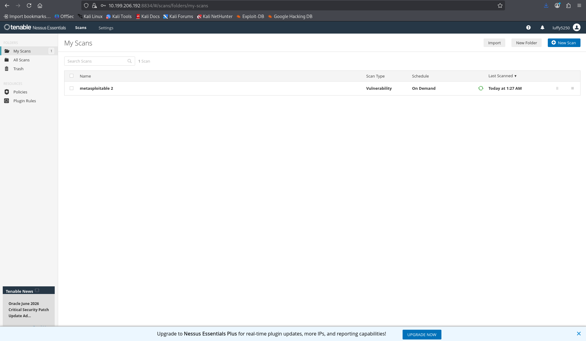

---

## 2. Monitor Scan Progress

### Scenario

I will watch the scan while it is running.

### Description

While the scan is running Nessus Essentials shows me

- the status of the scan

- how along the scan is

- how long the scan has been running

- how many plugins have been used

I can see that the scan is working on the target system.

### Screenshot

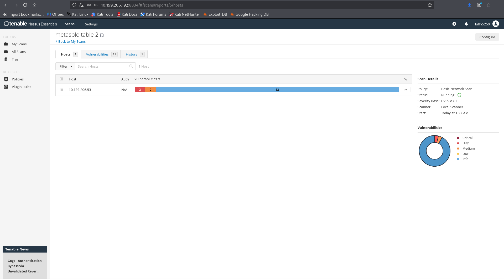

---

## 3. Verify Scan Completion

### Scenario

I will make sure that the vulnerability assessment is finished.

### Description

When the scan is finished it will say **Completed**. I can look at the results.

### Screenshot

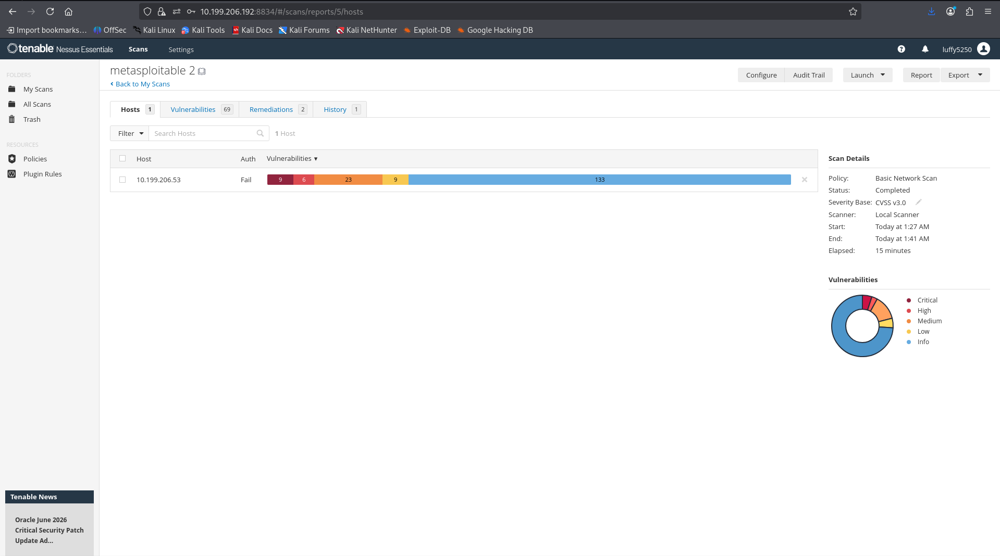

---

# Key Concepts Learned

- how to run a vulnerability assessment

- the steps that Nessus Essentials takes to do a scan

- how plugins are used in a scan

- how to watch the progress of a scan

- how to confirm that a scan is finished

---

# conclusion

In this part I learned

- how to start a vulnerability assessment using Nessus Essentials

- how to watch the progress of a scan

- how to confirm that a scan is finished

- how Nessus Essentials checks for vulnerabilities before making a report, about the target system.


-----------------------------------------------------------------------------------------------------------------------------------------------------------------------------------

# Part 4 – Looking at Vulnerability Findings

## What We Want to Do

We need to learn how to look at the results of a completed Nessus vulnerability scan. We have to understand what the vulnerability severity levels mean. We also need to know how to interpret CVE information and decide which problems to fix first.

---

# Why Look at Scan Results?

Just running a vulnerability scan is not enough.

A security analyst needs to know:

- What vulnerabilities were found

- How bad they are

- Why they are there

- Which systems are affected

- What to fix

Looking at the results properly helps organizations reduce security risks in a better way.

---

## 1. Open the Scan Report

### What We Are Doing

We are going to look at the results of the completed vulnerability assessment.

### Steps

1. Open **My Scans**.

2. Click on the completed scan.

### What Happens

When we open the completed scan we can see all the vulnerabilities that were found and the details of the assessment.

### Screenshot

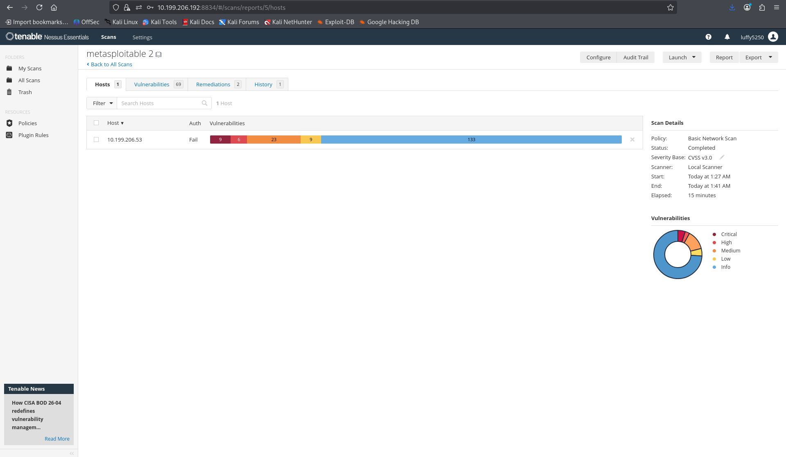

---

## 2. Look at the Vulnerability Summary

### What We Are Doing

We are going to look at the overview of vulnerabilities that Nessus generated.

### What We See

- bad problems

- Bad problems

- Medium problems

- Small problems

- Just information

### What It Means

The summary puts vulnerabilities into groups based on how bad they are. This helps us decide which ones to fix first.

### Screenshot


---

## 3. Look at One Vulnerability

### What We Are Doing

We are going to open one vulnerability from the report.

### What We Look At

- The name of the plugin

- The level of risk

- A description

- A solution

- The CVE number if we have it

### What We Learn

Each vulnerability has a lot of information that explains the problem and tells us how to fix it.

### Screenshot

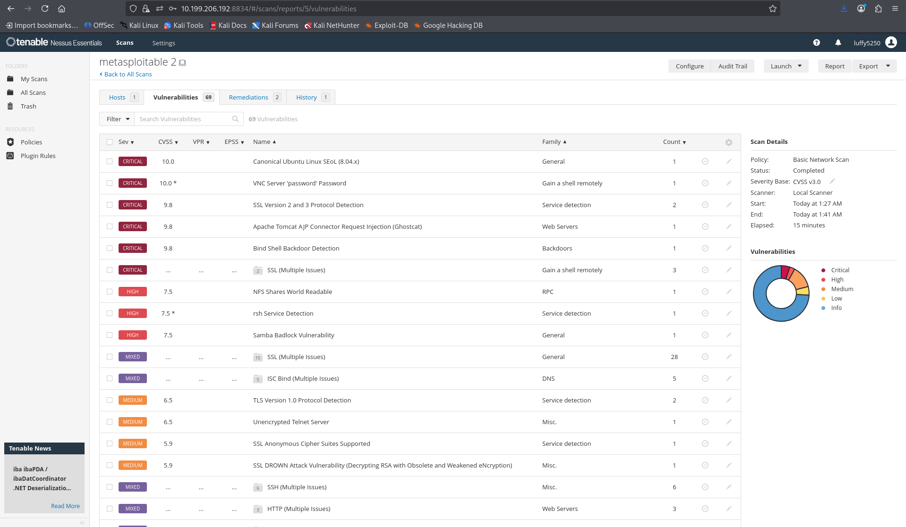

---

## 4. Look at the Recommended Fix

### What We Are Doing

We are going to understand how Nessus says we should fix the vulnerabilities it found.

### What We Do

We read the **Solution** section to see what Nessus recommends we do to fix the problem.

### Screenshot

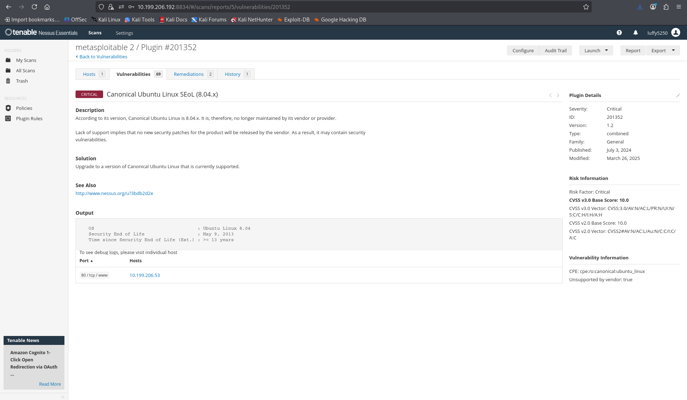

---

# Important Things We Learned

- How bad vulnerabilities are

- What CVE means

- Information, about plugins

- Looking at risk

- Fixing problems

---

# conclusion

In this part I learned:

- How to understand the results of a Nessus scan.

- How the level of severity helps us prioritize security problems.

- How to look at the details of one vulnerability.

- How Nessus tells us how to fix vulnerabilities.
