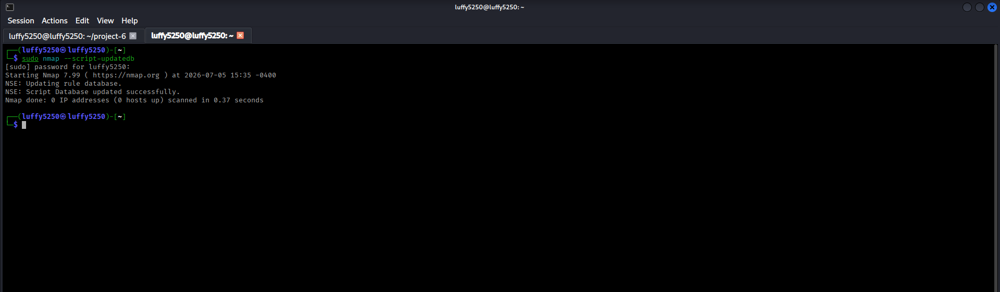
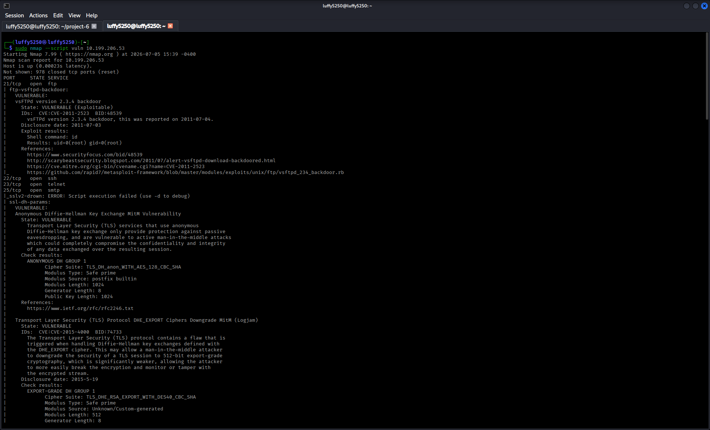
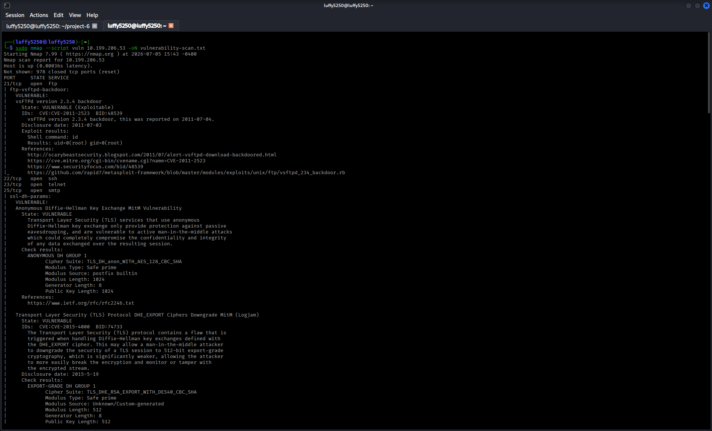
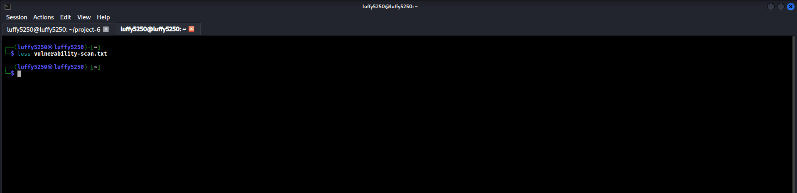
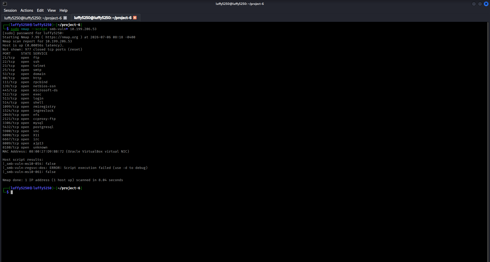
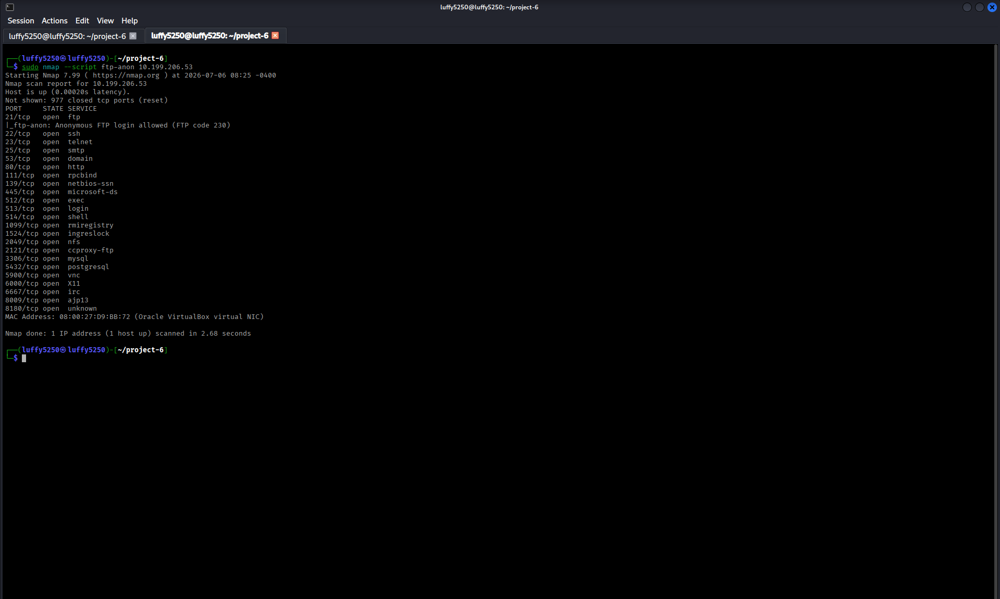
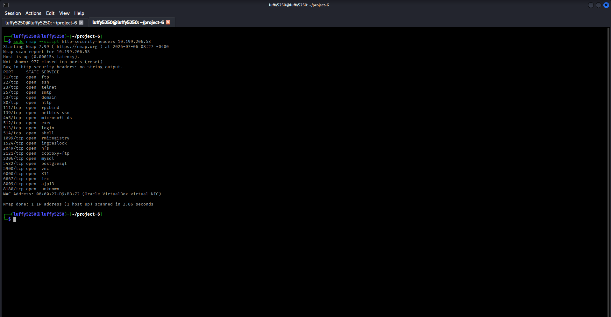
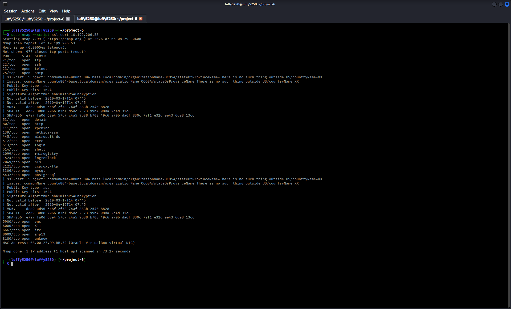

# vulnerability-analysis-project

# Part 1 – Introduction to Vulnerability Analysis

## Objective

I want to understand what Vulnerability Analysis is and how to do an assessment using Nmaps scripts to find vulnerabilities.

---

# What is Vulnerability Analysis?

Vulnerability Analysis is a process to find security weaknesses in systems and services before someone can exploit them.

It is different from Network Scanning.

Network Scanning finds hosts and services.

Vulnerability Analysis checks if those services have known security weaknesses.

The goal of Vulnerability Analysis is to:

- Find vulnerabilities

- Check security risks

- Decide what to fix first

- Make the security

---

# Vulnerability Analysis Workflow

1. Find the target

2. See what services are running

3. Detect what software versions are used

4. Compare them to known vulnerabilities

5. Write down the findings

---

## 1. Update the Nmap Script Database

### Scenario

I need to update the Nmap script database before I do a vulnerability assessment.

### Command

```bash

sudo nmap --script-updatedb

```

### Description

This command updates the Nmap script database so it knows about scripts.

### Screenshot



---

## 2. Run the Vulnerability Script Category

### Scenario

Now I do a vulnerability assessment, on the target.

### Command

```bash

sudo nmap --script vuln <target-ip>

```

### Description

This command runs all the Nmap scripts that check for vulnerabilities to see if the target has any.

Replace the IP address with the target IP address.

### Screenshot



---

## 3. Save the Vulnerability Report

### Scenario

I need to save the vulnerability assessment results.

### Command

```bash

sudo nmap --script vuln <target-ip> -oN vulnerability-scan.txt

```

### Description

This command saves the scan results in a text file.

### Screenshot



---

## 4. Review the Saved Report

### Scenario

Now I review the vulnerability report.

### Command

```bash

less vulnerability-scan.txt

```

### Description

This command opens the report so I can read it easily.

### Screenshot



---

# Key Concepts Learned

- Vulnerability Analysis

- NSE Vulnerability Scripts

- Vulnerability Identification

- Security Assessment

- Scan Reporting

---

# Conclusion

In this part, I learned:

- The purpose of Vulnerability Analysis.
- How Nmap NSE scripts detect known vulnerabilities.
- How to document vulnerability findings.
- How vulnerability reports support remediation planning.


------------------------------------------------------------------------------------------------------------------------------------------------------------------------------------------------------------

# Part 2 – Nmap NSE Vulnerability Scripts

## Objective

My goal is to learn how to use Nmap NSE vulnerability scripts to check for security weaknesses in network services like Nmap NSE vulnerability scripts.

---

# What are NSE Vulnerability Scripts?

Nmap NSE vulnerability scripts are part of the Nmap Scripting Engine or NSE for short. They help find common vulnerabilities, bad configurations and exposed services.

Unlike network scans Nmap NSE vulnerability scripts actually check if a service has known security issues.

---

## 1. Check for SMB Vulnerabilities

### Scenario

I want to check the SMB service for vulnerabilities like SMB vulnerabilities.

### Command

```bash

sudo nmap --script smb-vuln* <target-ip>
```

### Description

This command runs all Nmap NSE vulnerability scripts for SMB against the target to check for SMB vulnerabilities.

### Screenshot



---

## 2. Check FTP Anonymous Access

### Scenario

I need to find out if anonymous FTP login is allowed like FTP access.

### Command

```bash

sudo nmap --script ftp-anon <target-ip>
```

### Description

This command checks if the FTP server allows authentication, which is a type of FTP anonymous access.

### Screenshot



---

## 3. Check HTTP Security Configuration

### Scenario

I have to review HTTP security headers and basic web server configuration like HTTP security configuration.

### Command

```bash

sudo nmap --script http-security-headers <target-ip>
```

### Description

This command retrieves HTTP security headers to find weak configurations, which are part of HTTP security configuration.

### Screenshot



---

## 4. Detect SSL/TLS Support

### Scenario

I need to identify supported SSL/TLS protocols and certificates like SSL/TLS support.

### Command

```bash

sudo nmap --script ssl-cert <target-ip>
```

### Description

This command retrieves SSL certificate information if an HTTPS service is available which helps with SSL/TLS support.

### Screenshot



---

# Key Concepts Learned

- I learned about NSE Vulnerability Scripts

- I learned about SMB Vulnerability Checks

- I learned about FTP Anonymous Access

- I learned about HTTP Security Headers

- I learned about SSL Certificate Inspection

---

# conclusion

In this part I learned how to use individual NSE scripts to check specific services, like Nmap NSE vulnerability scripts.

I learned how to find FTP configurations and how HTTP security headers help with web security.

I also learned how SSL certificate information helps with vulnerability analysis and how NSE vulnerability scripts work.

I learned about Nmap NSE vulnerability scripts and how they help with security.
